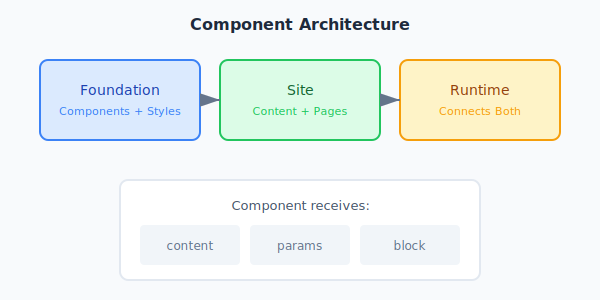

## Overview

Good component design is key to building maintainable Uniweb sites. In this article, we'll explore patterns that make components **flexible**, *reusable*, and easy to maintain.



## The Single Responsibility Principle

Each component should do **one thing well**. This makes components:

- Easier to understand
- Simpler to test
- More reusable across projects
- Faster to debug

> "A component should have one, and only one, reason to change."

## Using Content Structure

Uniweb provides a **guaranteed content structure**. Take advantage of this to write cleaner component code:

```jsx
// No defensive null checks needed!
export function Hero({ content, params }) {
  const { title, subtitle, paragraphs, links, imgs } = content

  // These are always defined (strings, arrays, etc.)
  return (
    <section>
      <h1>{title}</h1>
      <p>{subtitle}</p>
      {paragraphs.map((p, i) => <p key={i}>{p}</p>)}
    </section>
  )
}
```

## Component Categories

Organize components by their **purpose**:

| Category | Examples | Purpose |
|----------|----------|---------|
| Layout | Header, Footer, Sidebar | Page structure |
| Content | Hero, Features, Testimonials | Display content |
| Navigation | NavBar, Breadcrumbs | User navigation |
| Data | Cards, Tables, Lists | Display data collections |
| Interactive | Form, Modal, Accordion | User interaction |

## The meta.js Pattern

Every component should have a `meta.js` file that declares:

1. **Content expectations** - what content fields are used
2. **Parameters** - configurable options with defaults
3. **Presets** - predefined configurations

```javascript
export default {
  title: 'Hero Section',
  description: 'Main hero banner with title and CTA',
  category: 'content',

  content: {
    title: 'Main headline',
    subtitle: 'Supporting text',
    paragraphs: 'Additional content',
    links: 'Call-to-action buttons',
    imgs: 'Hero image [1]',
  },

  params: {
    theme: {
      type: 'select',
      options: ['light', 'dark', 'gradient'],
      default: 'light',
    },
    layout: {
      type: 'select',
      options: ['centered', 'split'],
      default: 'centered',
    },
  },
}
```

## Styling Best Practices

Use these patterns for consistent styling:

- **Tailwind utilities** for layout and spacing
- **CSS variables** for theme colors (`bg-primary`, `text-primary`)
- **Context classes** for section theming (`.context-light`, `.context-dark`)

```jsx
// Good: Uses theme-aware colors
<div className="bg-primary text-white">

// Good: Respects context
<div className="bg-context-bg text-context-fg">

// Avoid: Hardcoded colors
<div className="bg-blue-500 text-white">
```

## Further Reading

- [Content Structure Guide](/docs/content)
- [Kit Components Reference](/docs/kit)
- [Theming Documentation](/docs/theming)

---

*Have questions?* Check out our [Discord community](https://discord.gg/uniweb) or open an issue on [GitHub](https://github.com/uniweb/cli).
